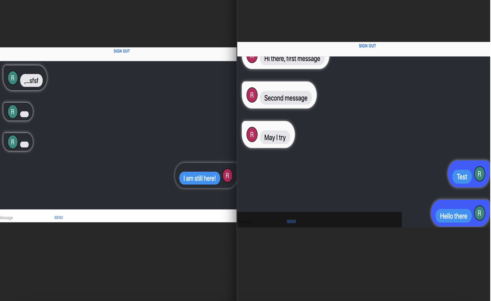

# Getting Started with Create React App

Project created with practical use and learning purposes. Users can access by logging with google.

## Tech used:
* Firebase
* React.js
* Express.js

## Process:
1. First create project => npx create react-app (name of your project)
2. Clean visual code environment
3. do (rfca) to create component: this will create a boiling template to create components. Snipped is needed, and it can be installed by clicking the extension box on the right hand side of visual studio code.
4. Create SignIn, Chat, SingOut, firebase, and SendMessage components.

## Test project
1. type (npm start) in the terminal to see local environment.
2. git init in GitHub
3. Create repo
4. type the following command to save the project:
    * git add .
    * git commit -m 'Add your comments here between this quotations'
    * git push

## Deployment
This project was deploy using vercel.com

[See vercel website](https://vercel.com/)

## Demo
[chat-app-firebase](https://chat-app-firebase-topaz.vercel.app/)